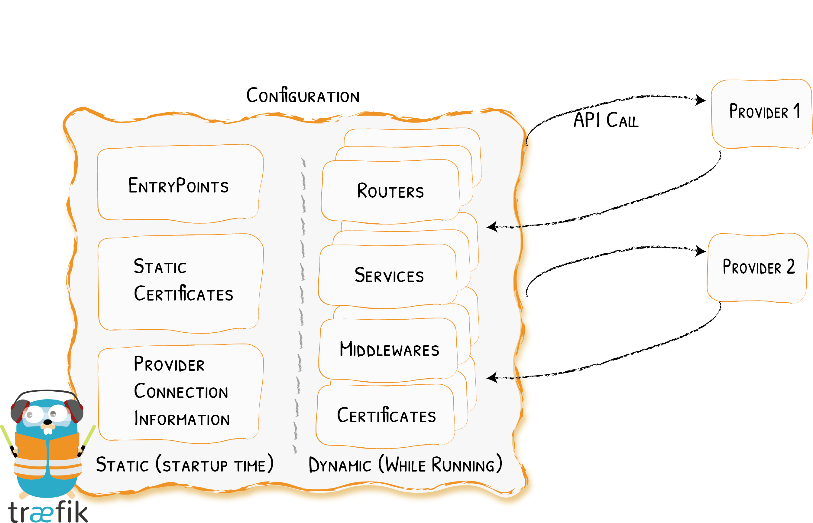

# Configuration Overview

How the Magic Happens
{: .subtitle }



Configuration in Traefik can refer to two different things:
   
   - The fully dynamic routing configuration (refered to as the _dynamic configuration_)
   - The startup configuration (refered to as the _static configuration_)

Elements in the _static configuration_ set up connections to [providers](../providers/overview.md) and define the [entrypoints](../routing/entrypoints.md) Traefik will listen to (these elements don't change often).

The _dynamic configuration_ contains everything that defines how the requests are handled by your system. This configuration can change and is seamlessly hot-reloaded, without any request interuption or connection loss.    

## The Dynamic Configuration 

Traefik gets its _dynamic configuration_ from [providers](../providers/overview.md): wether an orchestrator, a service registry, or a plain old configuration file. Since this configuration is specific to your infrastructure choices, we invite you to refer to the [dedicated section of this documentation](../providers/overview.md).

!!! Note 
   
    In the [Quick Start example](../getting-started/quick-start.md), the dynamic configuration comes from docker in the form of labels attached to your containers.
    
!!! Note
    
    HTTPS Certificates also belong to the dynamic configuration. You can add / update / remove them without restarting your Traefik instance. 
 
## The Static Configuration

There are three different locations where you can define static configuration options in Traefik:

- In a key-value store
- In the command-line arguments
- In a configuration file

If you don't provide a value for a given option, default values apply.

!!! important "Precedence Order"

    The following precedence order applies for configuration options: key-value > command-line > configuration file.
    
    It means that arguments override configuration file, and key-value store overrides arguments.
    
!!! important "Default Values"

    Some root options are enablers: they set default values for all their children. 
    
    For example, the `--providers.docker` option enables the docker provider. Once positionned, this option sets (and resets) all the default values under the root `providers.docker`. If you define child options using a lesser precedence configuration source, they will be overwritten by the default values.  
    
### Configuration File

At startup, Traefik searches for a file named `traefik.toml` in `/etc/traefik/`, `$HOME/.traefik/`, and `.` (_the working directory_).

You can override this using the `configFile` argument.

```bash
traefik --configFile=foo/bar/myconfigfile.toml
```

### Arguments

Use `traefik --help` to get the list of the available arguments.

### Key-Value Stores

Traefik supports several Key-value stores:

- [Consul](https://consul.io)
- [etcd](https://coreos.com/etcd/)
- [ZooKeeper](https://zookeeper.apache.org/)
- [boltdb](https://github.com/boltdb/bolt)

## Available Configuration Options

All the configuration options are documented in their related section. You can browse the available [features](../features/overview.md), the [providers](../providers/overview.md), or the [routing section](../routing/overview.md) to see them in action.
